# CycleGAN
PyTorch implementation of [CycleGAN](https://arxiv.org/pdf/1703.10593.pdf)
* Dataset can be downloaded from [here](https://people.eecs.berkeley.edu/~taesung_park/CycleGAN/datasets/).
* Loss values are plotted using [Tensorboard in PyTorch](https://github.com/yunjey/pytorch-tutorial/tree/master/tutorials/04-utils/tensorboard).

## horse2zebra dataset
* Image size: 256x256
* Number of training images: 1,334 for horse images, 1,067 for zebra images
* Number of test images: 120 for horse images, 140 for zebra images

### Results
* Adam optimizer is used. Learning rate = 0.0002, batch size = 1, # of epochs = 200:
* 6 resnet blocks used for Generator.

GAN losses  (  : Discriminator A /  : Discriminator B    : Generator A /  : Generator B    : Cycle loss A /  : Cycle loss B ) | Generated images (Input / Generated / Reconstructed)
:---:|:---:
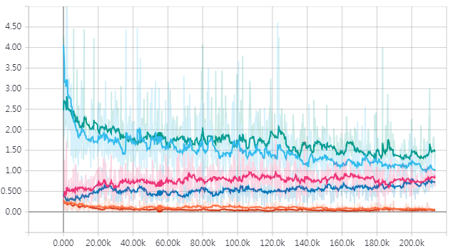 | 

* Generated images using test data

    |Horse to Zebra 1st column: Input / 2nd column: Generated / 3rd column: Reconstructed|
    |:---:|
    |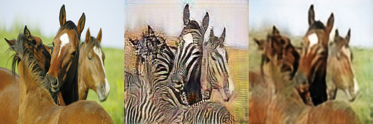|
    |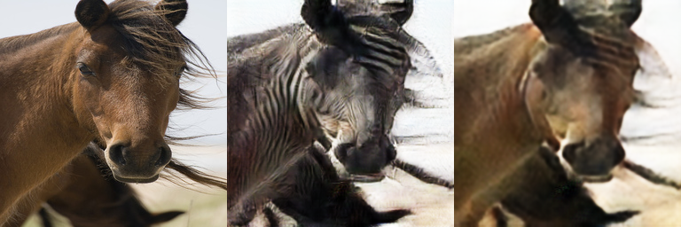|
    |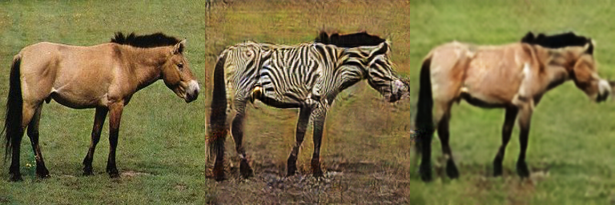|
    |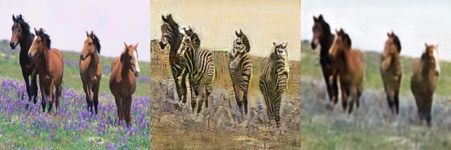|
    |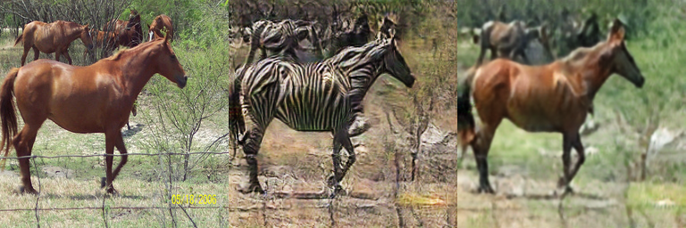|
    |Zebra to Horse 1st column: Input / 2nd column: Generated / 3rd column: Reconstructed|
    |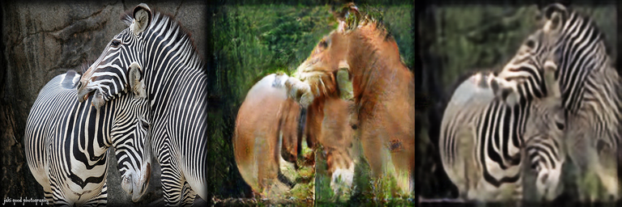|
    |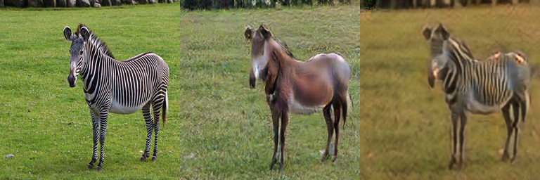|
    |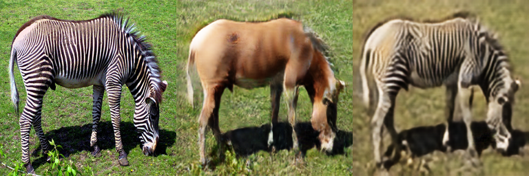|
    |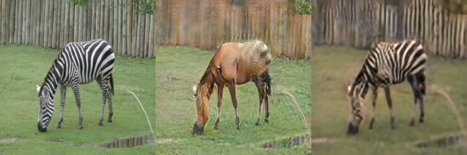|
    |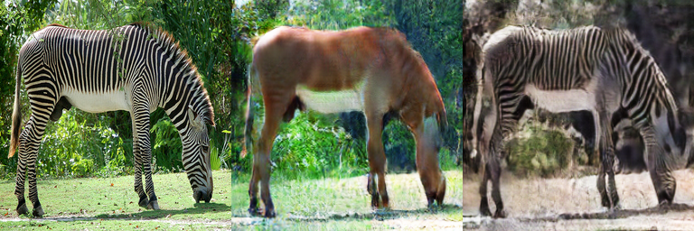|

## apple2orange dataset
* Image size: 256x256
* Number of training images: 1,019 for apple images, 995 for orange images
* Number of test images: 266 for apple images, 248 for orange images

### Results
* Adam optimizer is used. Learning rate = 0.0002, batch size = 1, # of epochs = 200:
* 9 resnet blocks used for Generator.

GAN losses  (  : Discriminator A /  : Discriminator B    : Generator A /  : Generator B    : Cycle loss A /  : Cycle loss B ) | Generated images (Input / Generated / Reconstructed)
:---:|:---:
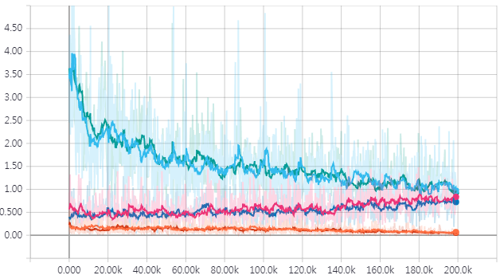 | 

* Generated images using test data

    |Apple to Orange 1st column: Input / 2nd column: Generated / 3rd column: Reconstructed|
    |:---:|
    |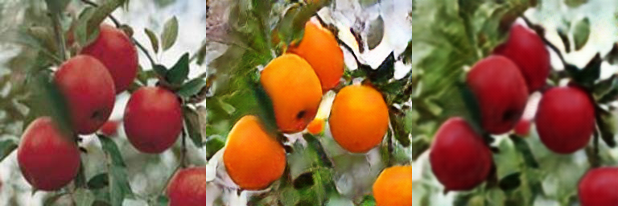|
    |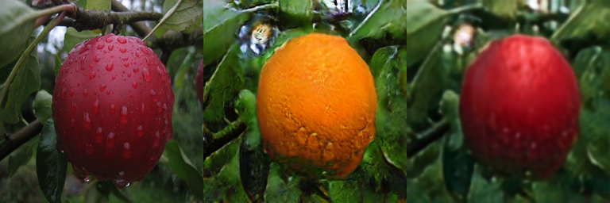|
    |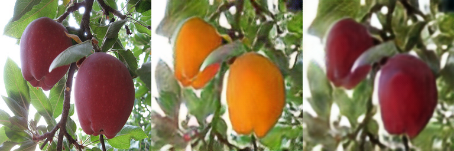|
    |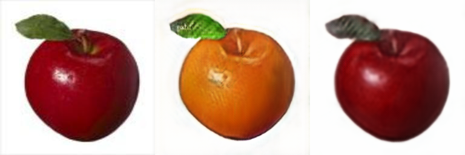|
    |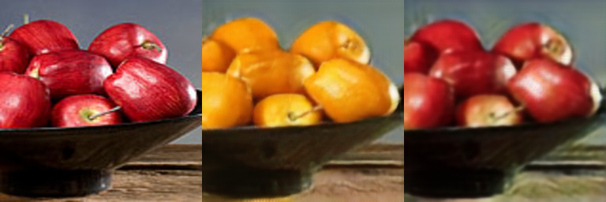|
    |Orange to Apple 1st column: Input / 2nd column: Generated / 3rd column: Reconstructed|
    |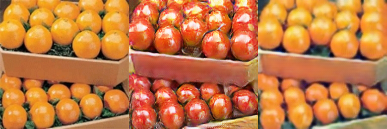|
    ||
    ||
    |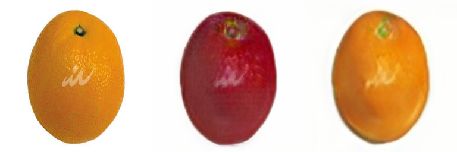|
    |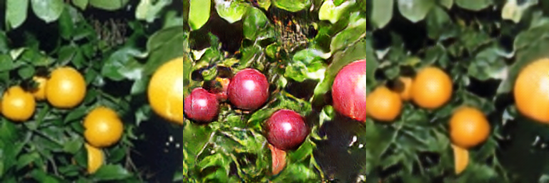|

### References
1. https://github.com/mrzhu-cool/CycleGAN-pytorch
2. https://github.com/junyanz/pytorch-CycleGAN-and-CycleGAN
3. https://github.com/znxlwm/pytorch-CycleGAN
4. https://affinelayer.com/CycleGAN/
